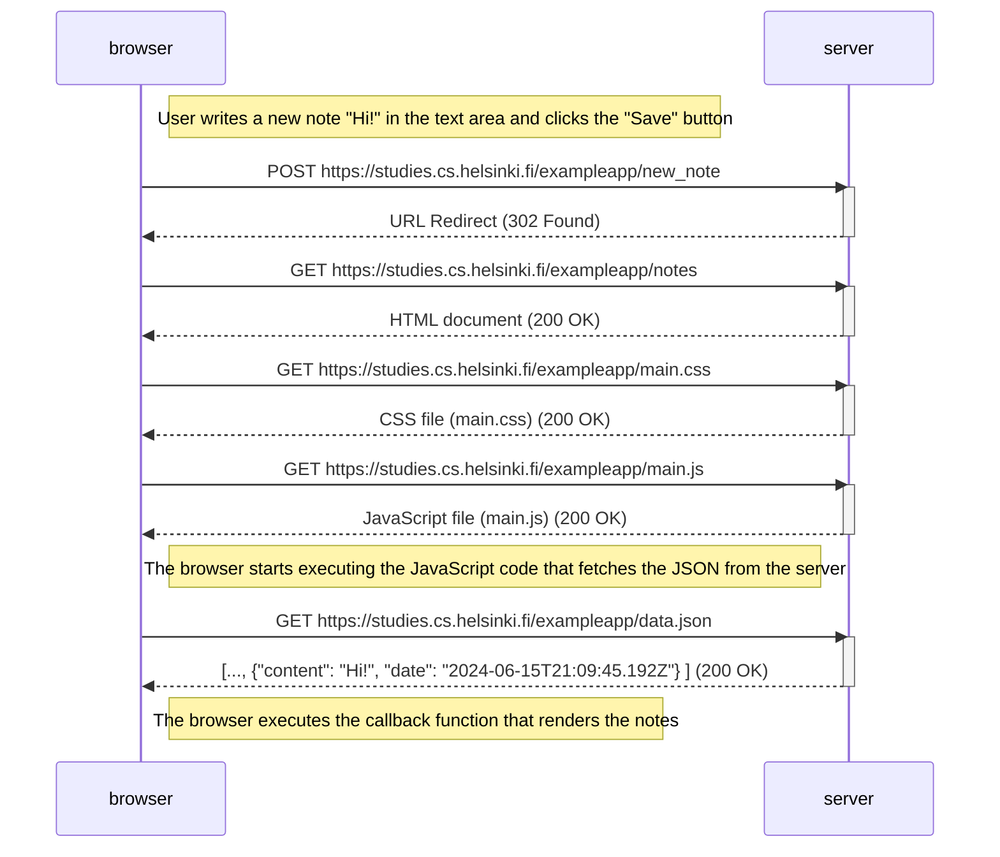

```mermaid
sequenceDiagram
    participant browser
    participant server

    Note right of browser: User writes a new note "Hi!" in the text area and clicks the "Save" button
    browser->>server: POST https://studies.cs.helsinki.fi/exampleapp/new_note
    activate server

    server-->>browser: URL Redirect (302 Found)
    deactivate server
    
    browser->>server: GET https://studies.cs.helsinki.fi/exampleapp/notes
    activate server
    server-->>browser: HTML document (200 OK)
    deactivate server

    browser->>server: GET https://studies.cs.helsinki.fi/exampleapp/main.css
    activate server
    server-->>browser: CSS file (main.css) (200 OK)
    deactivate server

    browser->>server: GET https://studies.cs.helsinki.fi/exampleapp/main.js
    activate server
    server-->>browser: JavaScript file (main.js) (200 OK)
    deactivate server

    Note right of browser: The browser starts executing the JavaScript code that fetches the JSON from the server
    browser->>server: GET https://studies.cs.helsinki.fi/exampleapp/data.json
    activate server
    server-->>browser: [..., {"content": "Hi!", "date": "2024-06-15T21:09:45.192Z"} ] (200 OK)
    deactivate server

    Note right of browser: The browser executes the callback function that renders the notes
```