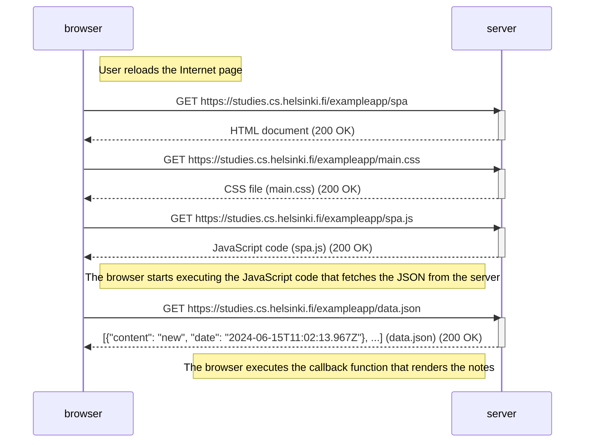

```mermaid
sequenceDiagram
    participant browser
    participant server

    Note right of browser: User reloads the Internet page
    browser->>server: GET https://studies.cs.helsinki.fi/exampleapp/spa
    activate server
    server-->>browser: HTML document (200 OK)
    deactivate server

    browser->>server: GET https://studies.cs.helsinki.fi/exampleapp/main.css
    activate server
    server-->>browser: CSS file (main.css) (200 OK)
    deactivate server

    browser->>server: GET https://studies.cs.helsinki.fi/exampleapp/spa.js
    activate server
    server-->>browser: JavaScript code (spa.js) (200 OK)
    deactivate server

    Note left of server: The browser starts executing the JavaScript code that fetches the JSON from the server

    browser->>server: GET https://studies.cs.helsinki.fi/exampleapp/data.json
    activate server
    server-->>browser: [{"content": "new", "date": "2024-06-15T11:02:13.967Z"}, ...] (data.json) (200 OK)
    deactivate server

    Note left of server: The browser executes the callback function that renders the notes
```